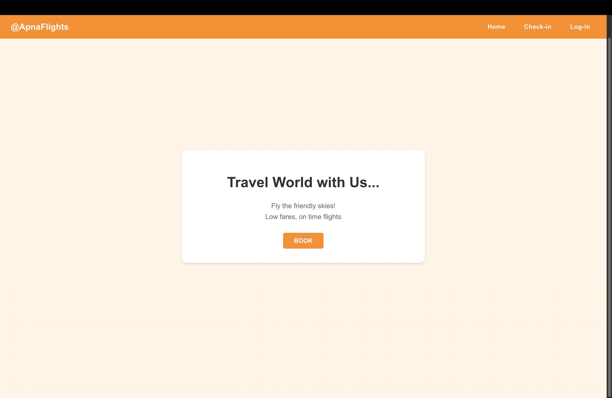
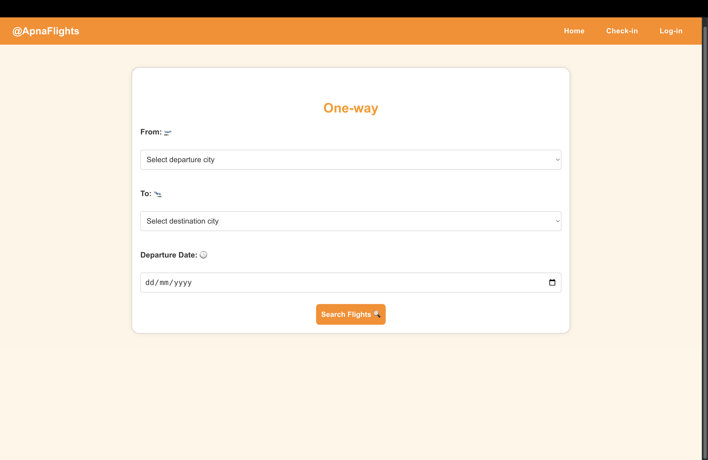
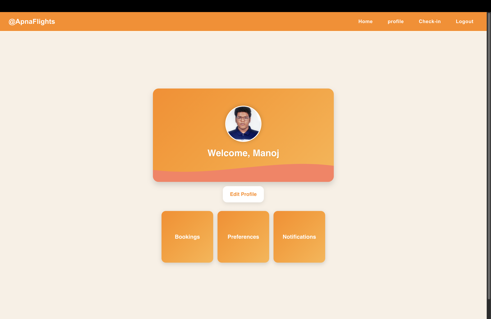
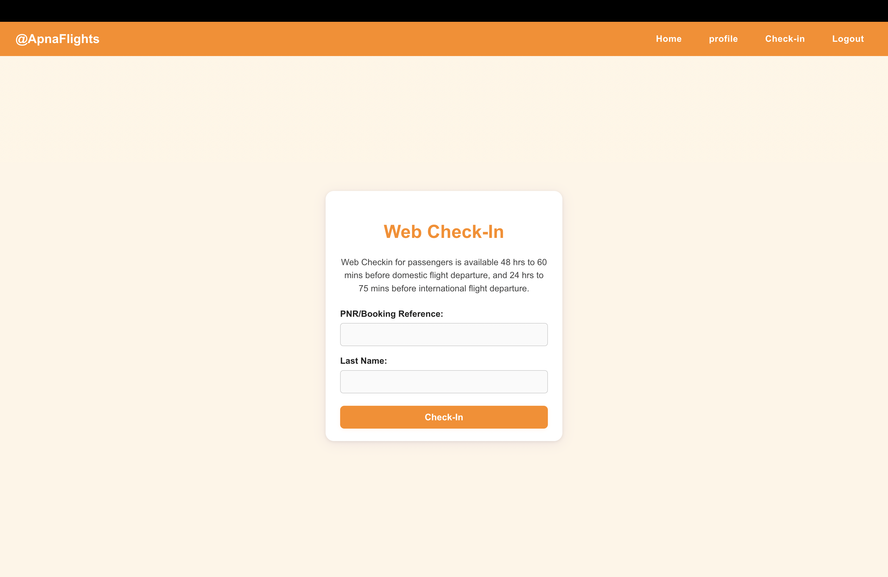

# Airline Management System

A full-stack web application for managing airline bookings, user profiles, flight schedules, and more. Built with a React + Vite frontend and a Node.js/Express backend.

## Features

- User authentication and profile management
- Flight search and booking
- Check-in and seat selection
- Admin panel for managing flights and bookings
- Email notifications

## Technologies Used

**Frontend:**
- React
- Vite
- CSS

**Backend:**
- Node.js
- Express.js

**Database:**
- MongoDB
- Mongoose (ODM for MongoDB)

**Email & Media:**
- Nodemailer (for sending emails)
- Cloudinary (for image/media storage)

**Other/Dev Tools:**
- dotenv (for environment variables)
- ESLint (for linting)
- Git & GitHub (version control)

## Screenshots

### Home Page


### Flight Search Page


### Profile Page


### Web Check-in Page


## Project Structure

```
Airline-Management-System/
  backend/         # Node.js/Express backend API
  public/          # Static assets for frontend
  src/             # React frontend source code
```

## Prerequisites

- Node.js (v16 or higher recommended)
- npm (comes with Node.js)
- MongoDB (for backend database)

## Installation

### 1. Clone the repository

```bash
git clone https://github.com/your-username/Airline-Management-System.git
cd Airline-Management-System
```

### 2. Install dependencies

#### Backend

```bash
cd backend
npm install
```

#### Frontend

```bash
cd ..
npm install
```

## Configuration

- Make sure MongoDB is running locally or update the connection string in `backend/config/db.js` to point to your MongoDB instance.
- Create a `.env` file in the `backend/` directory with the following variables:
  ```env
  MONGODB_URI=your_mongodb_connection_string
  AUTH_EMAIL=your_email@example.com
  AUTH_PASS=your_email_password
  FRONTEND_URL=http://localhost:5173
  BASE_URL=http://localhost:3000/
  PORT=3000
  CLOUDINARY_CLOUD_NAME=your_cloudinary_cloud_name
  CLOUDINARY_API_KEY=your_cloudinary_api_key
  CLOUDINARY_API_SECRET=your_cloudinary_api_secret
  ```
- (Optional) Create a `.env` file in the project root for frontend environment variables (if needed), e.g.:
  ```env
  VITE_API_URL=http://localhost:5000
  ```
- (Optional) Set up other environment variables for sensitive data as required by your setup.

## Running the Application

### 1. Start the Backend Server

```bash
cd backend
npm run serve
```

By default, the backend runs on `http://localhost:3000`.

### 2. Start the Frontend (React + Vite)

Open a new terminal window/tab:

```bash
npm run dev
```

The frontend will be available at `http://localhost:5173` (or as specified in the terminal).

## Usage

- Visit the frontend URL in your browser.
- Sign up or log in to start booking flights.
- Admin users can access additional management features.

## Contributing

Pull requests are welcome! For major changes, please open an issue first to discuss what you would like to change.

## License

[MIT](LICENSE)
